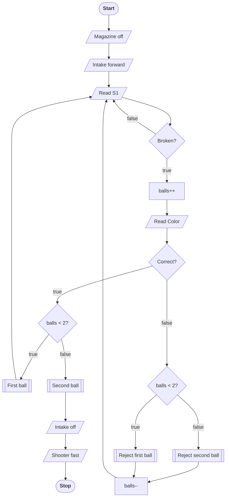
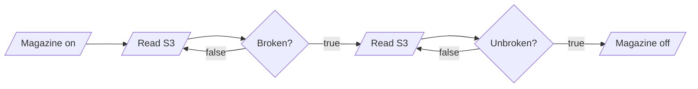
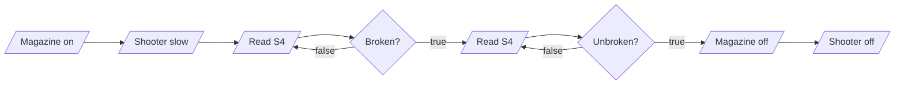
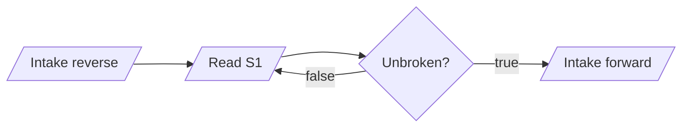

# Ball Management with no Ball Gates

```mermaid
flowchart TB
    start([<b>Start</b>])
    magOff0[/Magazine off/]
    intakeForward1[/Intake forward/]
    s1[/Read S1/]
    s1Check{Broken?}
    ball1Sub[[First ball]]
    ball2Sub[[Second ball]]
    dec[balls--]
    ballCheck1{balls < 2?}
    ballCheck2{balls < 2?}
    reject1Sub[[Reject first ball]]
    c1[/Read Color/]
    c1Check{Correct?}
    inc[balls++]
    reject2Sub[[Reject second ball]]

    start --> magOff0 --> intakeForward1 --> s1 --> s1Check
    s1Check -- true --> inc --> c1 --> c1Check
    s1Check -- false --> s1

    c1Check -- true --> ballCheck1
    c1Check -- false ---> ballCheck2

    ballCheck1 -- true --> ball1Sub --> s1
    ballCheck1 -- false --> ball2Sub

    ball2Sub --> inOff[/Intake off/] --> shooterFast[/Shooter fast/] --> stop([<b>Stop</b>])

    ballCheck2 -- true ---> reject1Sub
    ballCheck2 -- false ---> reject2Sub

    reject2Sub --> dec
    reject1Sub --> dec
    dec --> s1
```

## First ball

```mermaid
flowchart LR
    magOn1[/Magazine on/]
    s2_1[/Read S2/]
    s2Check_1{Broken?}
    s2_2[/Read S2/]
    s2Check_2{Unbroken?}
    magOff1[/Magazine off/]

    magOn1 --> s2_1 --> s2Check_1
    s2Check_1 -- false --> s2_1
    s2Check_1 -- true --> s2_2 --> s2Check_2
    s2Check_2 -- false --> s2_2
    s2Check_2 -- true --> magOff1
```

## Second ball

```mermaid
flowchart LR
    magOn2[/Magazine on/]
    s3_1[/Read S3/]
    s3Check_1{Broken?}
    s3_2[/Read S3/]
    s3Check_2{Unbroken?}
    magOff2[/Magazine off/]

    magOn2 --> s3_1 --> s3Check_1
    s3Check_1 -- false --> s3_1
    s3Check_1 -- true --> s3_2 --> s3Check_2
    s3Check_2 -- false --> s3_2
    s3Check_2 -- true --> magOff2
```

## Reject first ball

```mermaid
    flowchart LR
    magOn3[/Magazine on/] --> shooterSlow[/Shooter slow/] --> s4_1[/Read S4/] --> s4Check_1{Broken?}
    s4Check_1 -- false --> s4_1
    s4Check_1 -- true --> s4_2[/Read S4/] --> s4Check_2{Unbroken?}
    s4Check_2 -- false --> s4_2
    s4Check_2 -- true --> magOff3[/Magazine off/] --> shooterOff[/Shooter off/]
```

## Reject second ball

```mermaid
flowchart LR
    intakeReverse[/Intake reverse/] --> s1_2[/Read S1/] --> s1Check_2{Unbroken?}
    s1Check_2 -- false --> s1_2
    s1Check_2 -- true --> intakeForward2[/Intake forward/]
```
